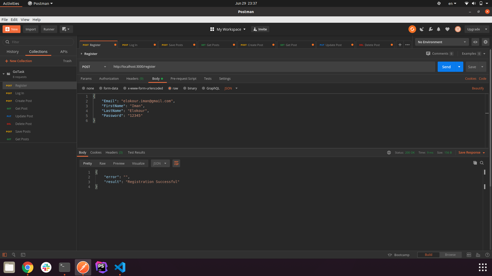
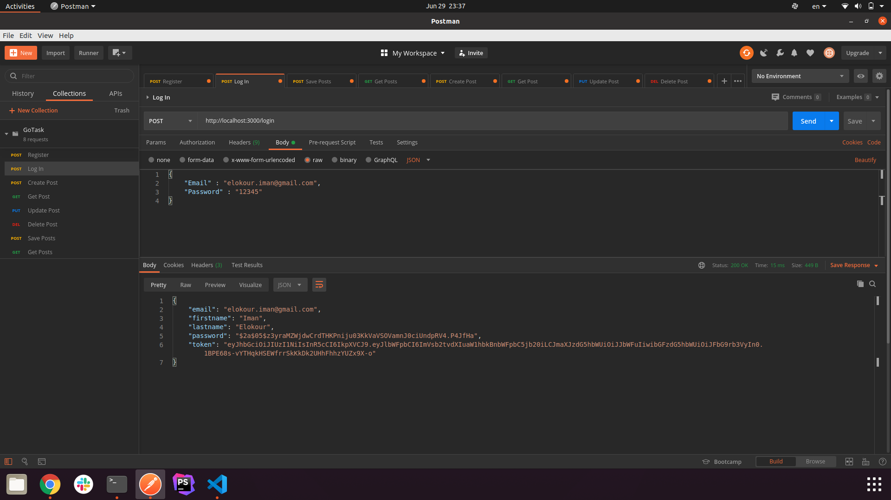
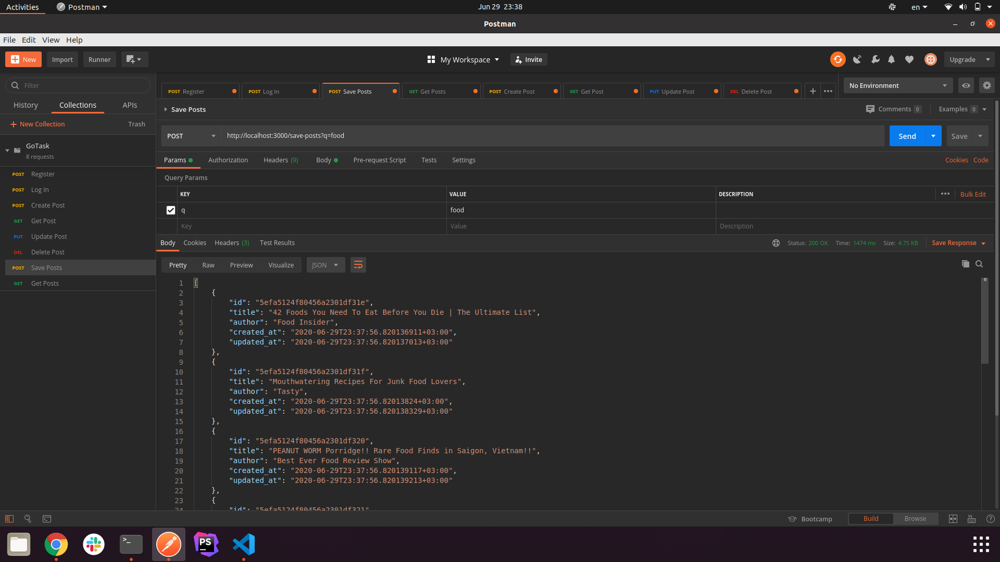
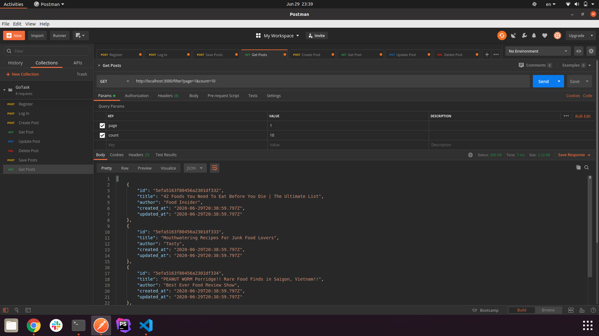
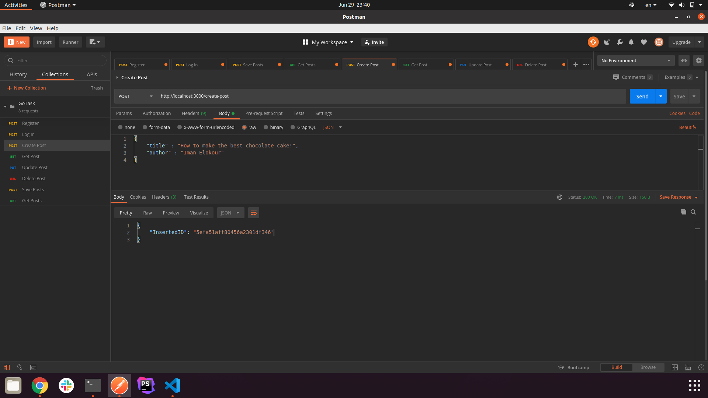
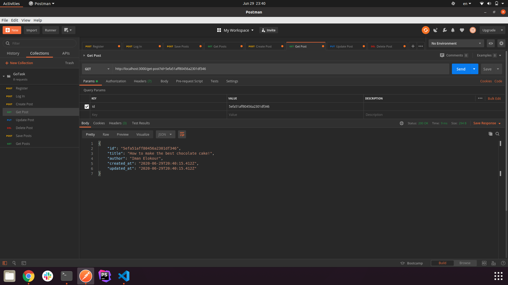
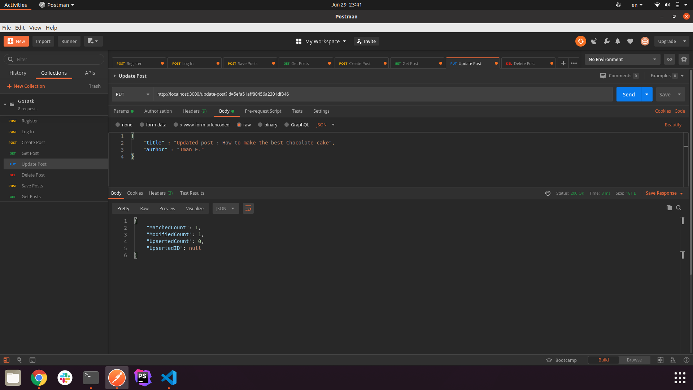
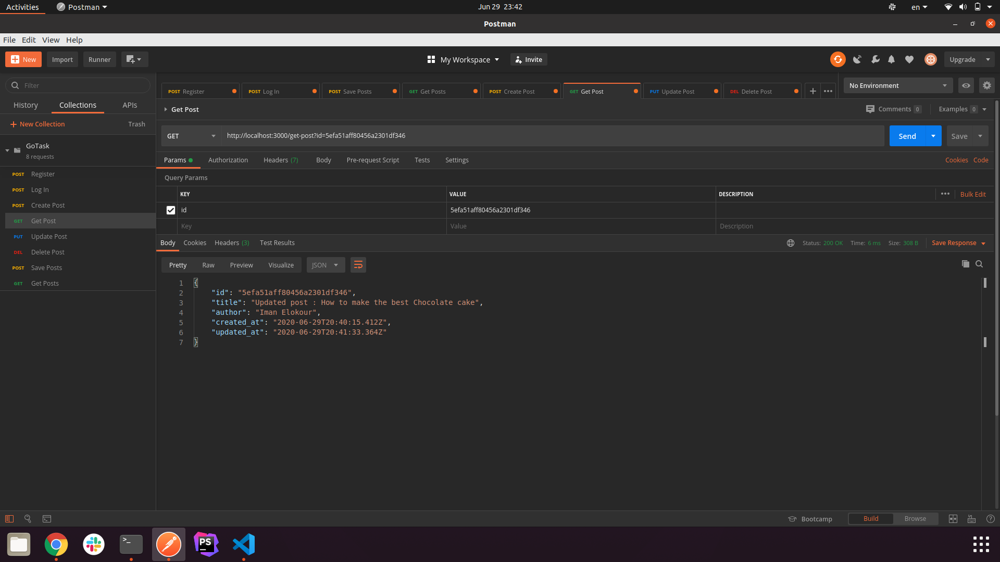
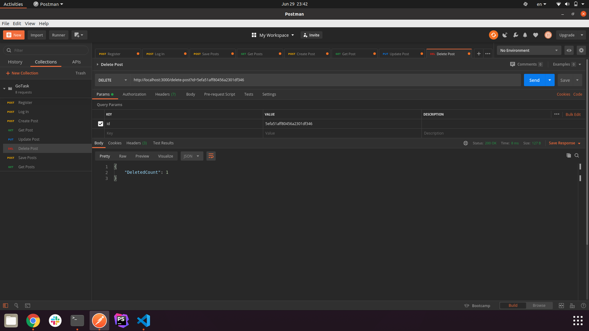
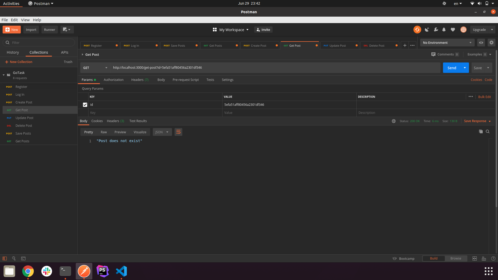

# Go_task

### NOTE:
> In this task I have replaced the twitter search API with a public youtube posts search API.
> The reason for the change is that twitter had not accepted my application for a develepor account,
> and therefore I didn't have any access to twitter's search API. So I decided to find an alternative
> in order to finish the task on time.
> Attached below are the screenshots for the all the API's results as required.

## **Register API :**

## **Log In API :**

## **Search API :**

#### *This Api fechtes data from an external api then saves them in the data base*

## **Gets Data from DB with pagination:**

#### *As you can see this is the first page with 10 items as the limit*

#### *And here is the second page with different items*

## **Create new post API :**

## **Get one post by ID :**

## **Update Post API :**

#### *As you can see the post has changed*

## **Delete Post API :**

#### *As you can see the post no longer exists in the data base*

